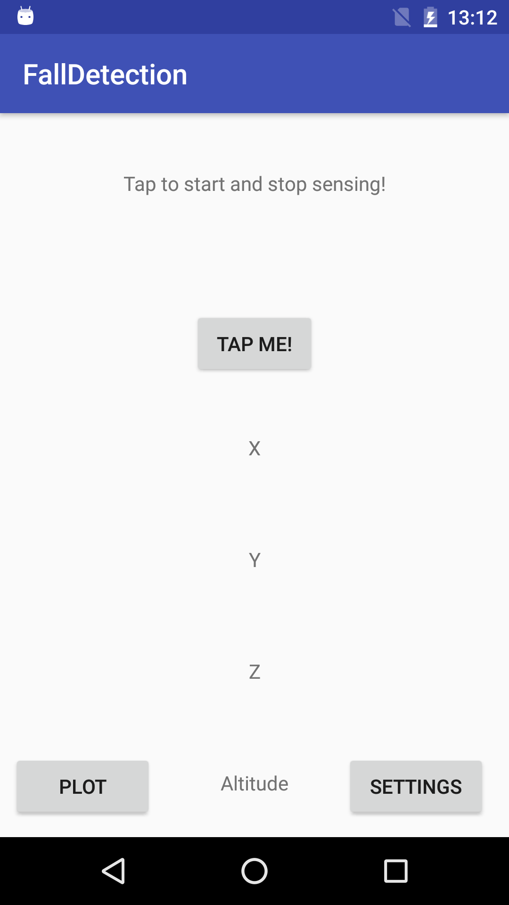
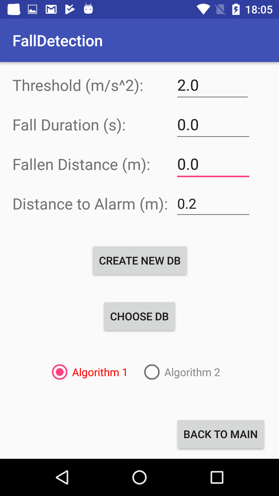
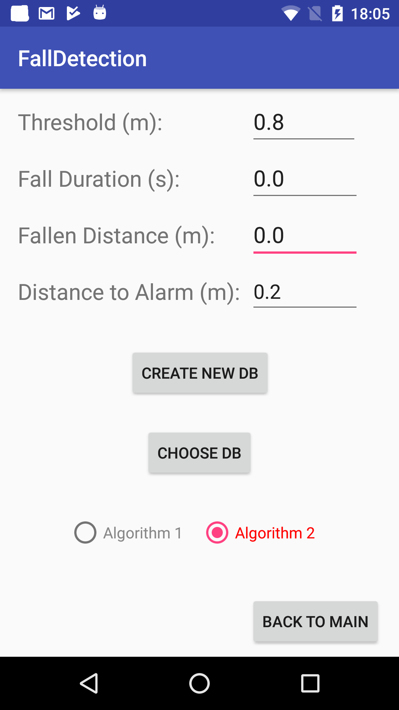
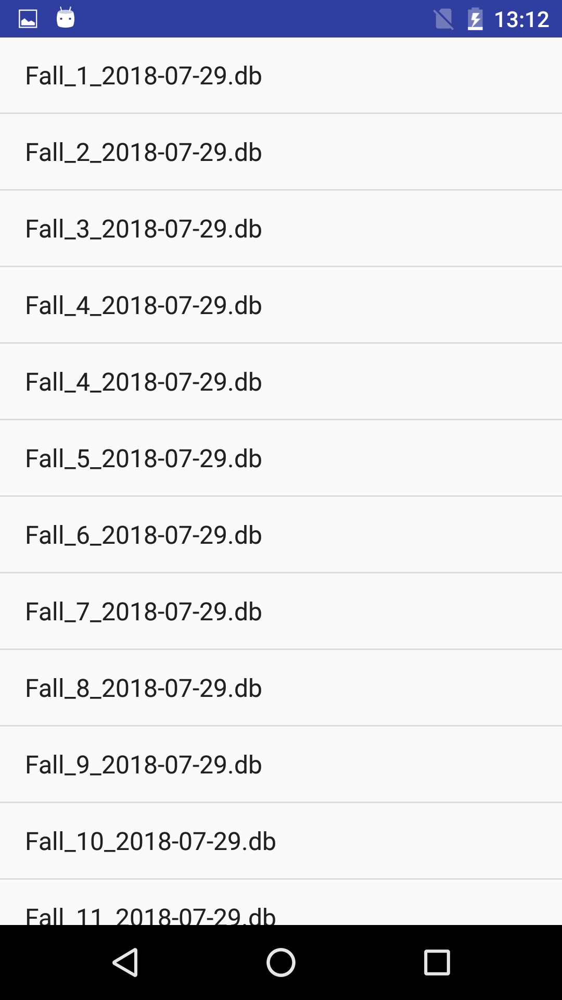
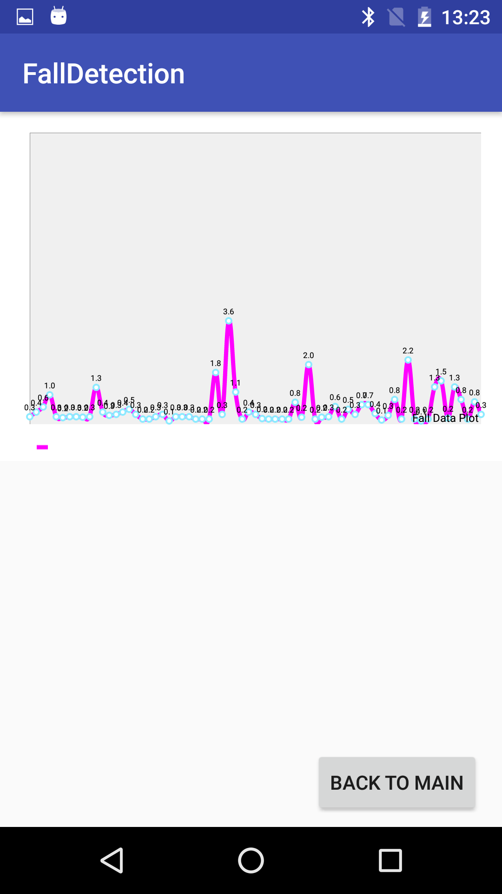

# Fall Detector

An Android Application to enhance the safety experience for rock climbers during climbing sessions.

This application detects fall events using the build in accelerometer and barometer sensors.
By calculating the current height in meters and detecting sudden movements under free fall conditions, this app is capable of informing the user how deep he has fallen. However in more severe conditions this functionality could be used to automatically alert emergency contacts.

# Fall Detector - Main View

Clicking Tap me! will start to sense for fall events.
Clicking Plot will plot all detected fall events.
Clicking Setting will forward the user to the settings view, where some additional configurations can be adjusted.

# FFall Detector - Settings View for 1st Algorithm

Threshold: The threshold variable can be set to increase or decrease the sensibility of the sensor. A higher threshold results in a higher sensibility of the sensor. I recommend to keep the default threshold as 2.0 m/s^2.

Fall Duration: is giving information on how long the latest fall event was in seconds.

Fallen Distance: is printing out how big the distance of the last fall event was in meters.

Distance to alarm: can be adjusted according to the users dependencies on when he wants to get informed that a fall event occurred depending on the calculated fallen distance. E.g setting this parameter to 0.1 will tell the application to inform the user about every fall that is bigger than 0.1 meters (10 cm).

Create New DB: can be clicked to create a new database where all new fall events are stored afterwards.
Choose DB: can be clicked to select an already existing database, to add some more fall events or to plot the existing fall events

Create New DB & Choose DB are both options that are implemented strictly for testing purposes to properly divide test sessions and make later analysis easier.

Radiobuttons: Two radiobuttons are available to choose the algorithm that is used to identify fall events

# Fall Detector - Settings View for 2nd Algorithm

Threshold: This threshold determines which fall events should be detected. E.g a threshold of 0.8 m is scanning the sensors altitude differences for fall events that are bigger than 0.8 meters. The larger the threshold, the more accurate the detection becomes.

Fall Duration: is giving information on how long the latest fall event was in seconds.

Fallen Distance: is printing out how big the distance of the last fall event was in meters.

Distance to alarm: can be adjusted according to the users dependencies on when he wants to get informed that a fall event occurred depending on the calculated fallen distance. E.g setting this parameter to 0.1 will tell the application to inform the user about every fall that is bigger than 0.1 meters (10 cm).

Create New DB: can be clicked to create a new database where all new fall events are stored afterwards.
Choose DB: can be clicked to select an already existing database, to add some more fall events or to plot the existing fall events

Create New DB & Choose DB are both options that are implemented strictly for testing purposes to properly divide test sessions and make later analysis easier.

Radiobuttons: Two radiobuttons are available to choose the algorithm that is used to identify fall events

# Fall Detector - Selecting DB View

Here a list is created with all existing databases. Clicking on a database will load this database to the application and all database specific fall events can be plotted in the application plotting view.

# Fall Detector - Plotted Graph View

Here all fall events are plotted.
